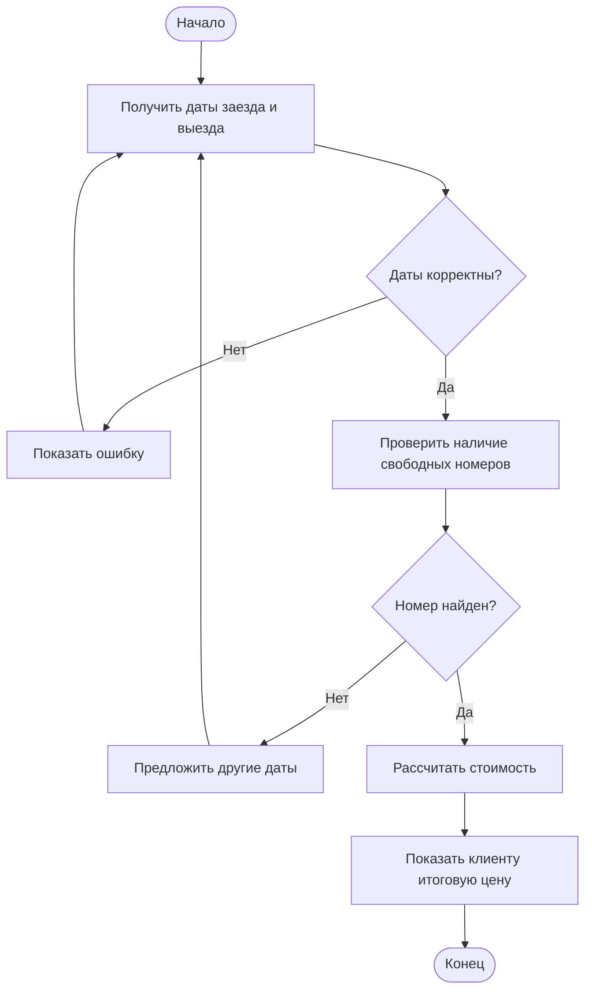

# Алгоритм проверки бронирования

```mermaid
flowchart TD
    A([Начало]) --> B[Получить даты заезда и выезда]
    B --> C{Даты корректны?}
    C -- Нет --> D[Показать ошибку]
    D --> B
    C -- Да --> E[Проверить наличие свободных номеров]
    E --> F{Номер найден?}
    F -- Нет --> G[Предложить другие даты]
    G --> B
    F -- Да --> H[Рассчитать стоимость]
    H --> I[Показать клиенту итоговую цену]
    I --> J([Конец])
```