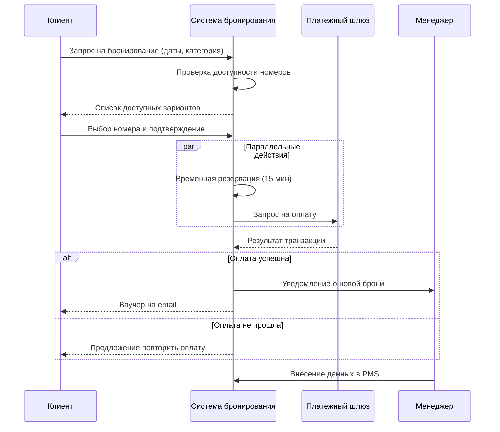

#Бронирование номера в отеле

```mermaid
sequenceDiagram
    participant K as Клиент
    participant S as Система бронирования
    participant P as Платежный шлюз
    participant M as Менеджер

    K->>S: Запрос на бронирование (даты, категория)
    S->>S: Проверка доступности номеров
    S-->>K: Список доступных вариантов
    K->>S: Выбор номера и подтверждение
    par Параллельные действия
        S->>S: Временная резервация (15 мин)
        S->>P: Запрос на оплату
    end
    P-->>S: Результат транзакции
    alt Оплата успешна
        S->>M: Уведомление о новой брони
        S-->>K: Ваучер на email
    else Оплата не прошла
        S-->>K: Предложение повторить оплату
    end
    M->>S: Внесение данных в PMS
```