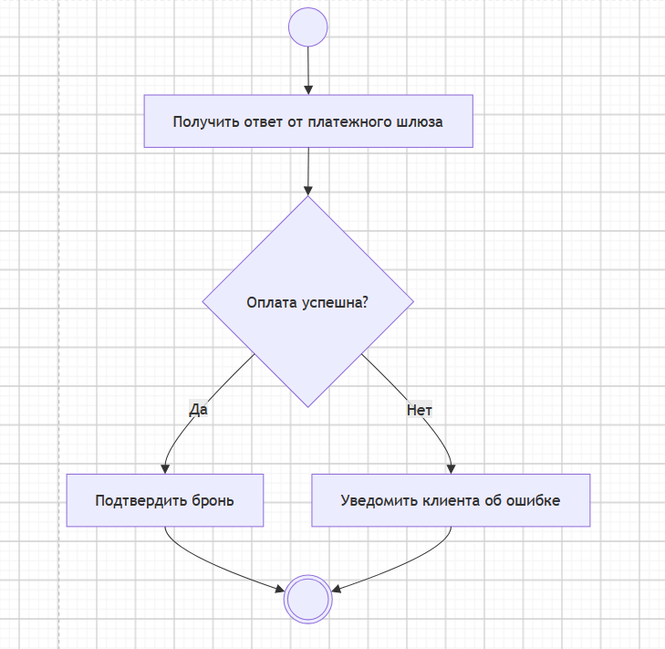
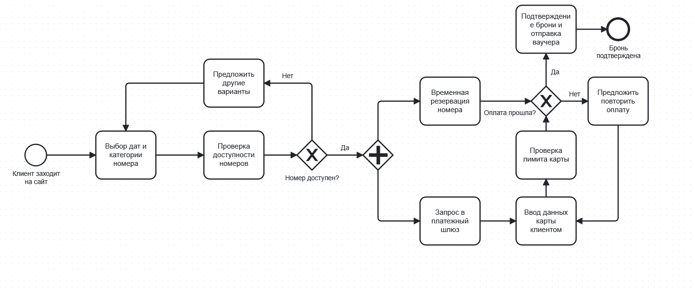

Я моделировал процесс онлайн-бронирования номера в отеле. Основная идея в том, что клиент 
выбирает номер, оплачивает, затем система подтверждает бронирование. Если какой-то из этапов 
ветвления(доступность номера, статус оплаты) не проходит, система будет запрашивать повторное 
прохождение определённых процессов. 

Вывод: я разобрался как настроить git-репозиторий, освоил базовые команды и графическую нотацию,
увидел разницу между текстовыми и бинарными форматами при версионировании.
Текстовые гит разбивает на строки и отслеживает изменения, а бинарные просто сравнивает
и говорит изменён ли файл.
Также разобрался какие диаграммы лучше подходят для различных задач.
BPMN используется, когда нужно установить понятный стандарт того, кто и какую работу выполняет.
UML нужен, чтобы показать логику выполнения конкретного процесса.
Sequence показывает взаимодействие различных систем проекта во времени.

