Отчёт:
**Студент:** Шило Денис  
**Группа:** УИР-241
**Дата:** 04.10.2026
В ходе лабораторной работы я освоил Node-RED как low-code инструмент для 
визуального программирования. Собрал 12 потоков, охватывающих базовые и продвинутые ноды
Дополнительно выполнил ачивку №10 — работа с базой данных SQLite.
**Способ установки:** npm (глобальная установка).
node v24.21.0
Node-RED version: v5.0.7
Освоенные ноды:
- **Базовые:** inject, debug, function, switch, change, template.
- **Сетевые:** http request, http in, http response, mqtt in, mqtt out.
- **Dashboard:** ui_gauge, ui_chart.
- **Telegram:** telegram command, telegram sender.
- **Файлы:** file in (read file), file out (write file).
- **Контекст:** работа через `flow.get/set`, `global.get/set`.
- **SQLite:** sqlite, работа с базой данных.
AI-промпты использовал например при написании функций на js или при создании sql-запросов
Помоги составить SQL-запросы для создания двух таблиц (students и logs) и операций вставки/выборки
Напиши Function-нодус базовыми элементами JavaScript: let/const, if/else, цикл for, массив, объект
Скриншоты

## Скриншоты

### Часть 1. Версия Node-RED и Node.js

### Часть 2.1 — Inject → Debug
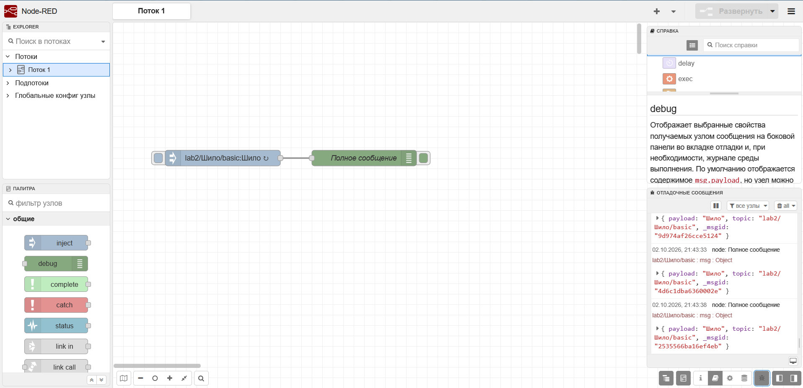

### Часть 2.2 — Function node
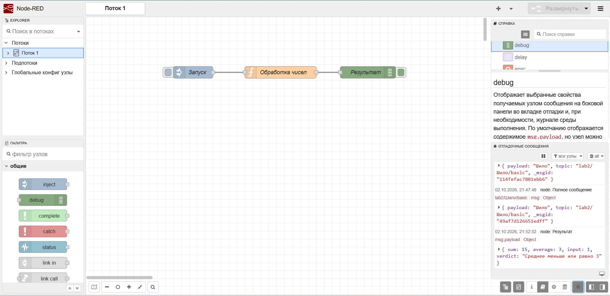

### Часть 2.3 — Switch node
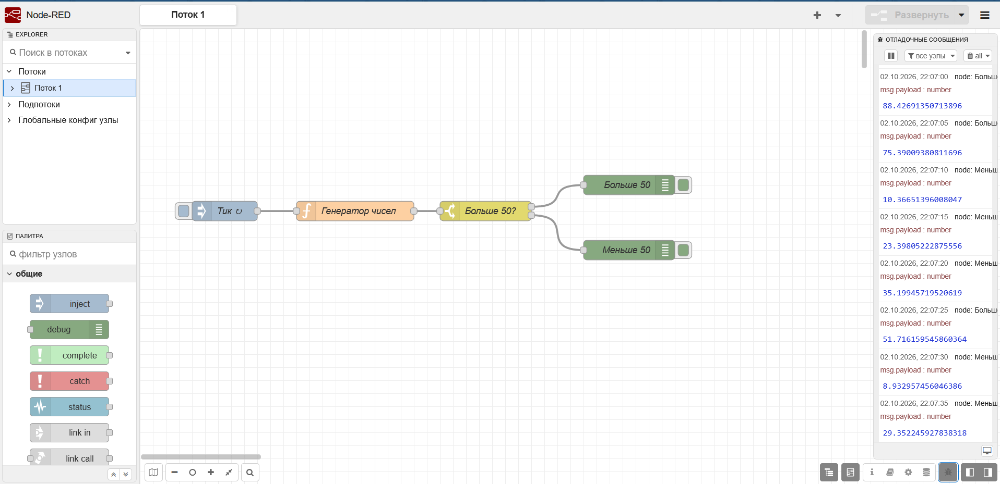

### Часть 2.4 — Change node
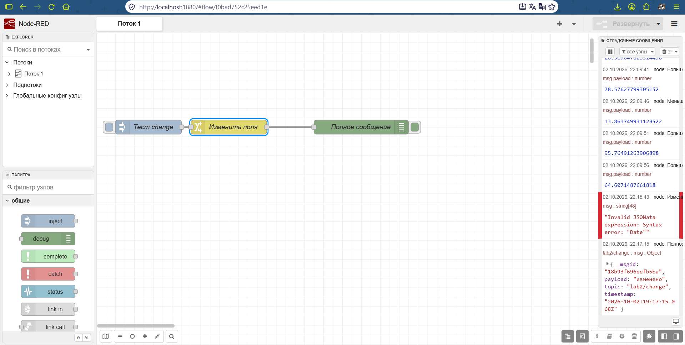

### Часть 2.5 — Template node
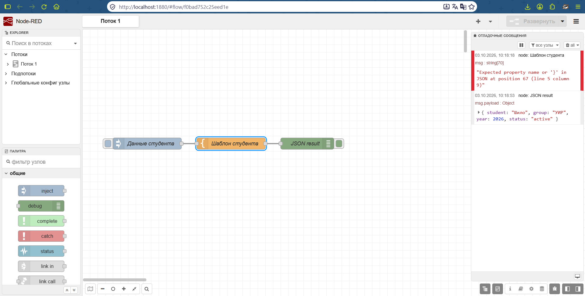

### Часть 2.6 — HTTP Request
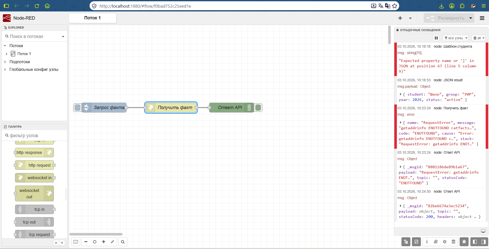

### Часть 2.7 — MQTT
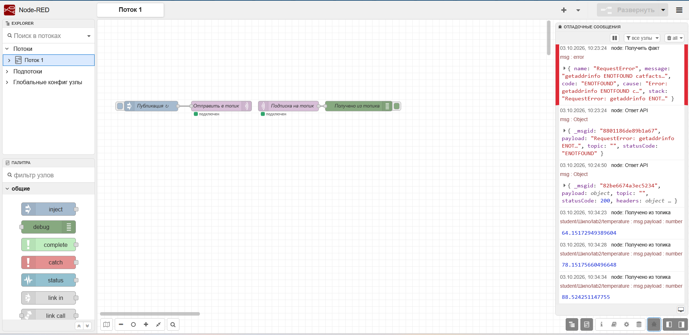

### Часть 2.8 — GET-эндпоинты

**Успешный запрос `/api/text`:**
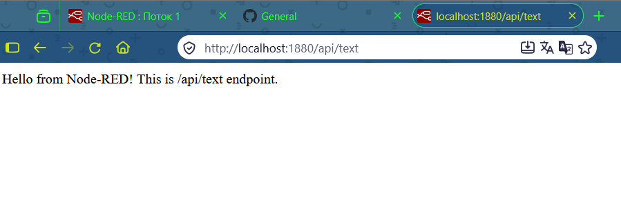

**Успешный запрос `/api/info`:**
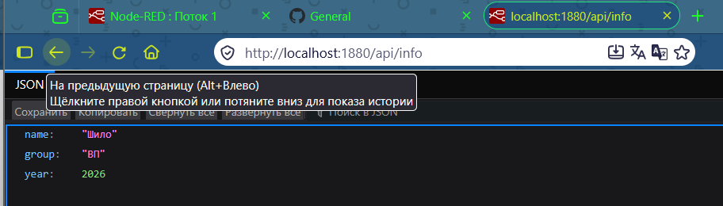

**Успешный запрос `/api/items/5`:**
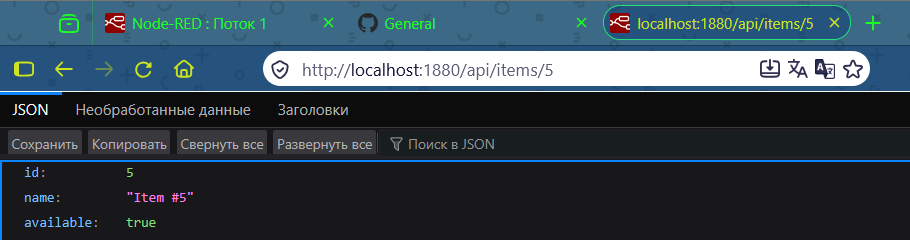

**Ошибка 400 (`/api/items/abc`):**
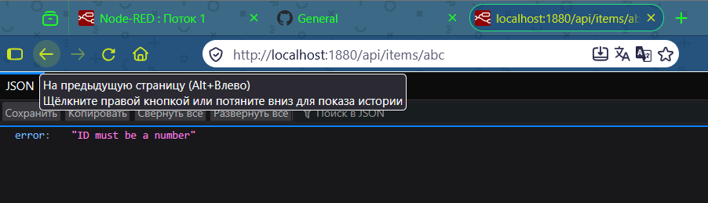

**Ошибка 404 (`/api/items/500`):**
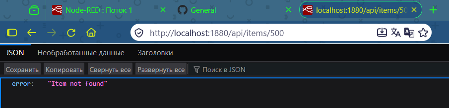

### Часть 2.9 — Dashboard
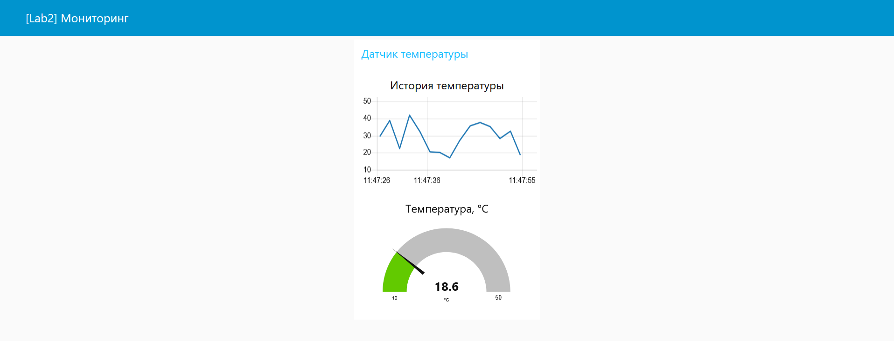

### Часть 2.10 — Telegram-бот
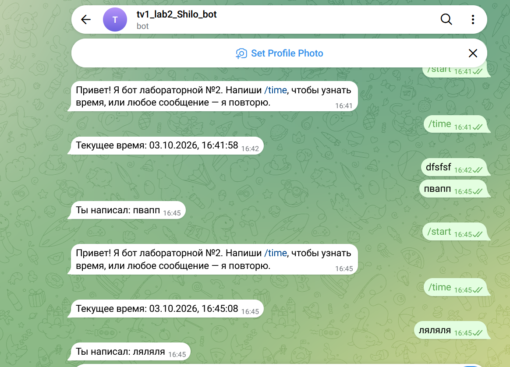

### Часть 2.11 — Файлы
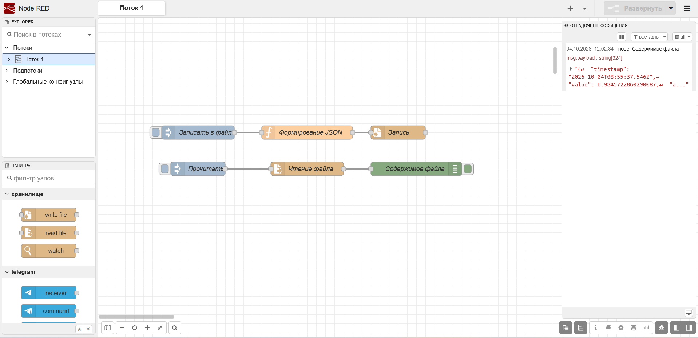

### Часть 2.12 — Контекст
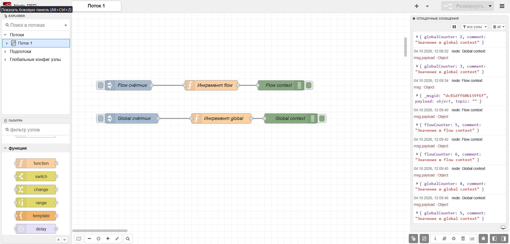

### Ачивка 10 — SQLite

**Работа с SQLite (создание таблиц, вставка, выборка):**
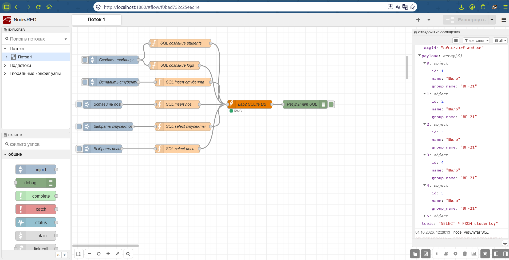

**Сохранение после перезапуска Node-RED:**
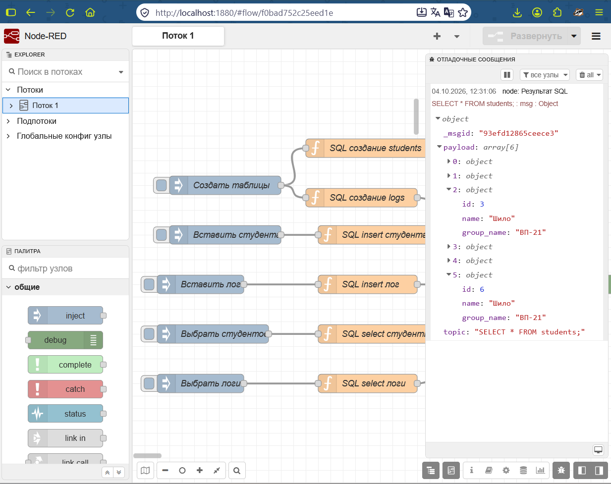

Вывод: Во время выполнения я освоил основные ноды в node-red, их связь, понял в каких сферах 
это применимо. Node-red способен облегчить жизнь тем, кто не хочет разбираться в синтаксисе js, 
но при этом хочет например создать тг-бота. Также я познакомился с SQLite расширением? для 
node-red, которое вместе с нодами для тг дают много возможностей для реализации своих проектов.
